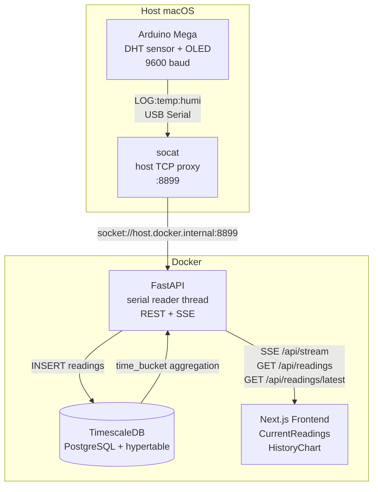
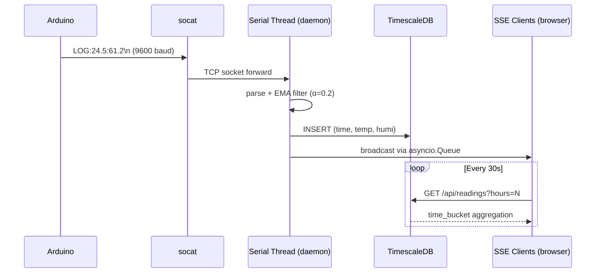

# Humidity Tracker

A full-stack IoT project that reads temperature and humidity from an Arduino sensor, stores the data in TimescaleDB, and displays live and historical readings in a web dashboard.

## Architecture



### Data flow



**Why socat?** Docker Desktop on macOS runs inside a Linux VM and cannot pass USB devices into containers. `socat` bridges the Arduino serial port to a TCP socket on the host; the API container connects to it via `host.docker.internal:8899`. On Linux, you can mount the device directly and drop the socat step.

## Hardware

- Arduino Mega
- DHT temperature/humidity sensor on pin D3
- SSD1306 OLED display on I2C

The Arduino sketch applies an **EMA filter** (α = 0.2) to smooth sensor noise before transmitting readings. It emits one line per reading over serial:

```
LOG:<temperature>:<humidity>
```

## Prerequisites

| Tool | Install |
|---|---|
| Arduino IDE | flash `humidity_tracker.ino` |
| Docker Desktop | [docker.com](https://www.docker.com/products/docker-desktop/) |
| socat | `brew install socat` |

## Quick start

```bash
# 1. Flash the Arduino sketch
#    Open humidity_tracker.ino in Arduino IDE and upload to the board.

# 2. Start everything (runs detached — safe to close the terminal)
./start.sh

# 3. Stop everything
./stop.sh
```

`start.sh` will:
1. Auto-detect the Arduino serial device (`/dev/cu.usbmodem*`)
2. Start a socat TCP proxy forwarding it to port 8899 (detached, PID saved to `/tmp/.humidity_tracker_socat.pid`)
3. Bring up all Docker services in detached mode (`db`, `api`, `frontend`)

Open **http://localhost:3000** to see the dashboard.

To force a Docker image rebuild (e.g. after code changes):

```bash
./start.sh --build
```

To override the serial device:

```bash
SERIAL_DEV=/dev/cu.usbmodem1234 ./start.sh
```

To view live logs after starting:

```bash
docker compose logs -f api
```

## Project structure

```
humidity_tracker/
├── humidity_tracker.ino      # Arduino sketch (EMA filter, OLED display, serial output)
├── init.sql                  # TimescaleDB schema (hypertable + index)
├── docker-compose.yml        # db + api + frontend services
├── start.sh                  # One-command startup (detached: socat + docker compose)
├── stop.sh                   # Stop socat + docker compose
├── .env.example              # Environment variable reference
├── api/
│   ├── main.py               # FastAPI server
│   ├── pyproject.toml        # Python dependencies (managed with uv)
│   ├── uv.lock               # Locked dependency versions
│   └── Dockerfile
└── frontend/
    ├── src/
    │   ├── app/              # Next.js App Router
    │   └── components/
    │       ├── CurrentReadings.tsx   # Live values via SSE
    │       └── HistoryChart.tsx      # Historical chart (Recharts)
    ├── next.config.js
    └── Dockerfile
```

## API endpoints

| Method | Path | Description |
|---|---|---|
| `GET` | `/api/health` | Health check |
| `GET` | `/api/readings/latest` | Most recent reading |
| `GET` | `/api/readings?hours=24&limit=500` | Aggregated historical data |
| `GET` | `/api/stream` | Server-Sent Events live stream |

Historical data is automatically bucketed by time window (1 min / 5 min / 15 min / 1 hour).

## Environment variables

See `.env.example` for all options. Key variables for `start.sh`:

| Variable | Default | Description |
|---|---|---|
| `SERIAL_DEV` | auto-detect | Arduino serial device path |
| `SERIAL_BAUD` | `9600` | Baud rate (must match the sketch) |
| `PROXY_PORT` | `8899` | TCP port used by the socat bridge |

## Development

### Updating Python dependencies

```bash
cd api
uv add <package>       # add a dependency
uv sync                # sync venv after manual pyproject.toml edits
```

### Rebuilding a single service

```bash
docker compose build api
docker compose up -d api
```

### Viewing logs

```bash
docker compose logs -f api
docker compose logs -f frontend
```
